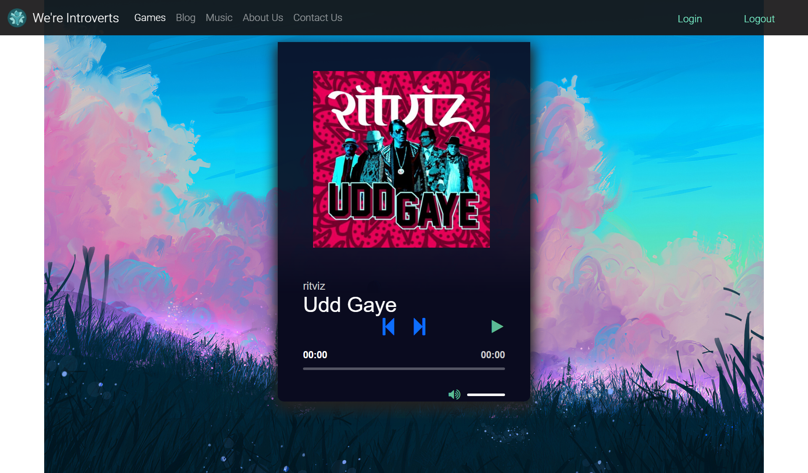

<div align="center">
  <h1> <a href= "http://139.59.75.144/" target="_blank">We’re Introverts!</a> </h1>
</div>

<br>
<p align="center">

</p>
<br> 

### We usually hear 
- Introverts don’t like to talk
- Introverts are shy
- Introverts always want to be alone
- Introverts are aloof nerds

### Let’s break these clichés
Usually, we find ourselves surrounded by people not interacting with each other. They can spend all day with us but won’t talk. These people are called introverts. They don’t have anything against extroverts but they just like enjoying their own company. This site is all about them. This site is the one stop for all introvert needs. A person here can anonymously write blogs, play games, and even listen to music with anyone around the world.
We're a team of 5 members (all introverts), thus the website.

#### This website accomplishes these goals
- To set up environment for introverts by introverts
- Introverts here get the chance to discover and create their community
- They get chance to know the perspective of other introverts in different parts of the world
- It maintains their privacy and they can simultaneously have fun

### Webiste URL
You can visit the website using the following address: [http://139.59.75.144/](http://139.59.75.144/)


### How to run this webiste locally?
For runnning this website, you need to install [docker](https://docs.docker.com/engine/install/) in your system. After installing docker you can pull the image using the following commands:
```
docker pull madhavmehndiratta/codejam-pragmatic-pinatas:latest
docker run --name codejam-app -d -p 80:80 madhavmehndiratta/codejam-pragmatic-pinatas
```
Then you can visit the website by navigate to `http://127.0.0.1` to view the website.

### Navigating the website:

- Visit We’re Introvert website and click on ‘Sign Up’ button on home page. It will take you to the sign-up form.


<br>
<p align="center">

</p>
<br>

<br>
<p align="center">

</p>
<br>


- If you are already a member. Click on login here in sign-up form or login button on navbar. It will take you to login form.


<br>
<p align="center">

</p>
<br>


- After successfully logging in you will be redirected to homepage from there you will able to access any link on navbar (games,blog,music). 
- Here if you try to signup again. It will show you message that you already logged in.


<br>
<p align="center">

</p>
<br>


- On clicking games, User can play any game globally.


<br>
<p align="center">

</p>
<br>


- On clicking blog, user can read some blogs related to Technology, Space, Food and Sports.


<br>
<p align="center">

</p>
<br>


- Music is most imp part of any schedule. While travelling or doing daily task we hear songs. Here in website, we integrated music player. From were a user can listen beautiful songs.


<br>
<p align="center">

</p>
<br>


- To sign out from website. Click on logout button on navbar. And you will be successfully logout and will be redirected to homepage

### Technologies Used:

#### Fronted

```
HTML
Bootstrap
CSS
JavaScript
```

#### Backend

```
Python
Django
Docker
```

### Known Issues
- Website is not fully responsive
- The seek bar in music app contain bugs

### Features to Add
- Support for mobile website.
- Add support to post your own blogs anonymously.
- Add chatbox where a user can chat with other users on the website anonymously.
- Add support to upload your own songs in music app.
- Add a "rooms" feature where users can listen to a same song together.

### Team Prigmatic Pinatas
- [Arnav](https://github.com/arnavaggarwal2012)
- [Madhav](https://github.com/madhavmehndiratta)
- [Deepak](https://github.com/DeathRay99)
- [Mihir](https://github.com/mihir224)
- Avikal
